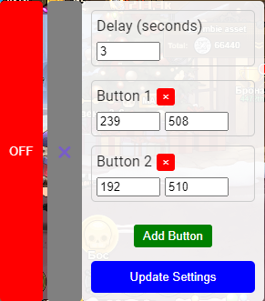

# Bombie Catizen Auto-Clicker Script

With this guide, you'll be able to set up auto-play for **Bombie Catizen** and automate repetitive actions with ease. If you need further clarification or assistance, feel free to reach out. 🚀 [telegram](https://t.me/tor_dev)

## 📋 **Script Overview**
This script automates the clicking of specific coordinates on the game screen, making it especially useful for players who want to enable an auto-play mode. It allows automatic clicks on designated buttons with random delays to mimic human-like behavior.

---

## 🛠️ **How to Launch the Script**
1. **Add the Script to the Game**:
   - Insert the entire code into the browser's or Telegram developer console (press `F12`, go to the **Console** tab, paste the code, and press `Enter`).
   - Alternatively, add it to the page using [Violentmonkey](https://violentmonkey.github.io/) or [Tapermonkey](https://www.tampermonkey.net/index.php?browser=chrome) or another user script manager. 
     - For install [script](https://github.com/TOR968/Bombie/raw/main/Bombie.user.js)
     - Start [Bombie](https://t.me/catizenbot/bombie?startapp=g_1002_27496787_2044)

2. **Control Panel**:

    
   - Once the script is loaded, a control panel will appear in the upper-right corner of the screen.
   - The panel includes two main buttons:
     - 🔴 **OFF /** 🟢 **ON** — Toggles the automatic clicking on and off.
     - ⚙️ **Settings** — Opens the coordinate settings panel.

---

## 📍 **How to Set Up Coordinates**
1. **Define Click Coordinates**:

    
   - You can customize the click coordinates through the settings panel.
   - Click the ⚙️ (gear) button in the control panel.
   - Enter new X, Y coordinates for the two buttons labeled **Box Button Green** and **Equip Button Blue**.
   
   

2. **Save Changes**:
   - After entering the new coordinates, click **Update Coordinates**.
   - The new coordinates will be saved to your browser's local storage, so you won't have to reconfigure them every time you reload the game.

---

## ⚙️ **How to Use Auto-Click Mode**
1. Press the **OFF** button in the upper-right corner (it will change to **ON** and turn green).
2. The script will automatically begin clicking the buttons at the configured coordinates with random delays.
3. To stop the automation, press the **ON** button, and it will switch back to **OFF**.

---

## 🕹️ **Key Features**
- **Automatic Clicks on Two Points**: The script clicks on two pre-configured buttons (green and blue) by default.
- **Customizable Coordinates**: You can change the coordinates for the buttons via the control panel.
- **Coordinate Persistence**: The script saves your coordinate settings in the browser's local storage.
- **Random Delays**: Randomized delays (1000–1500 ms) between clicks for human-like interaction.
- **Click Indicators**: Visual indicators appear on the screen to show where and when clicks happen.

---

## ❗ **Notes and Tips**

- If the button coordinates aren't accurate, try adjusting your screen resolution or use the **SelectingCoordinates.js** tool for precise positioning.
- Write down the resulting coordinates and restart the game.
---

## Activating Developer Console in Telegram Desktop

To run this script using Telegram Desktop:

Open Telegram Desktop
Go to Settings > Advanced > Experimental settings
Find and enable the "Enable webview inspecting" option

On macOS: Right-click and choose "Inspect" in the webview windows, or open from the Develop menu in Safari
On Windows/Linux: Use the keyboard shortcut Ctrl + Shift + I or F12

Restart Telegram Desktop to apply the changes

---

## Disclaimer

This script is for educational purposes only. Use it at your own risk and make sure you comply with the terms of service of the platform you're using it on.

## License

This project is open source and available under the [MIT License](LICENSE).

